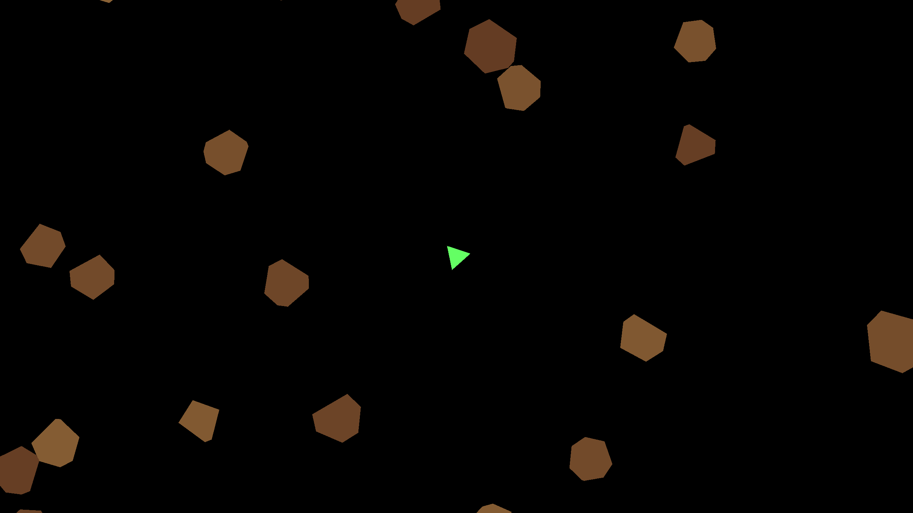

# Asteroids



## Introduction
This **Asteroids** game is a remaster of the classic space shooter game.
This document explains how to **compile the game** and **generate its Doxygen documentation**.

---

## Prerequisites
Before compiling the project, ensure you have the following installed:

### **Required Dependencies**
- **C++ Compiler** (GCC, Clang, or MSVC)
- **CMake** (version 3.10+ recommended)
- **SFML** (Simple and Fast Multimedia Library)
- **Doxygen** (for generating documentation)

### **Installing Dependencies**
#### **Linux (Debian/Ubuntu)**
```sh
sudo apt update
sudo apt install g++ cmake libsfml-dev doxygen
```
#### **Windows**
1. Download and install:
   - [MinGW-w64](https://www.mingw-w64.org/) for GCC
   - [SFML](https://www.sfml-dev.org/download.php) for Windows
   - [CMake](https://cmake.org/download/)
   - [Doxygen](https://www.doxygen.nl/download.html)

2. Add all installed tools to the **system PATH**.

#### **macOS**
```sh
brew install sfml cmake doxygen
```

---

## Compiling the Project

### **Clone the Repository**
```sh
git clone https://github.com/yourusername/Asteroids.git
cd Asteroids
```

### **Configure the Build System with CMake**
```sh
mkdir build
cd build
cmake ..
```

### **Compile the Game**
```sh
cmake --build .
```
This will generate the **`Asteroids.exe`** inside the `build/` directory.

### **Ensure the Correct Folder Structure**
After compilation, make sure the directory structure is as follows:
```
Asteroids/
├── Asteroids.exe
├── data/
├── fonts/
```
The **`data/`** and **`fonts/`** folders must be in the **same level** as `Asteroids.exe`, or the game may not find the required assets.

### **Handle SFML DLLs on Windows**
On Windows, **SFML requires DLL files to be in the same directory as the executable**. Ensure that your `Asteroids.exe` is in the root folder along with the SFML DLLs:
```
Asteroids/
├── Asteroids.exe
├── sfml-graphics-d-2.dll
├── sfml-window-d-2.dll
├── sfml-system-d-2.dll
├── sfml-audio-d-2.dll
├── sfml-network-d-2.dll
```
If the game doesn’t launch, check that you have **all required DLLs** in the correct location.

### **Run the Game**
To run the game:
```sh
./Asteroids
```
On **Windows**, double-click **`Asteroids.exe`**.

---

## Generating the Documentation

### **Ensure Doxygen is Installed**
Verify that Doxygen is installed by running:
```sh
doxygen --version
```
If not installed, see the **Prerequisites** section above.

### **Generate Documentation**
Inside the project root, run:
```sh
doxygen Doxyfile
```
This will generate the documentation inside `docs/doxygen/html/`. Open the `index.html` in your browser.

On **Linux/macOS**:
```sh
xdg-open docs/doxygen/html/index.html
```
On **Windows**, double-click `index.html`.
